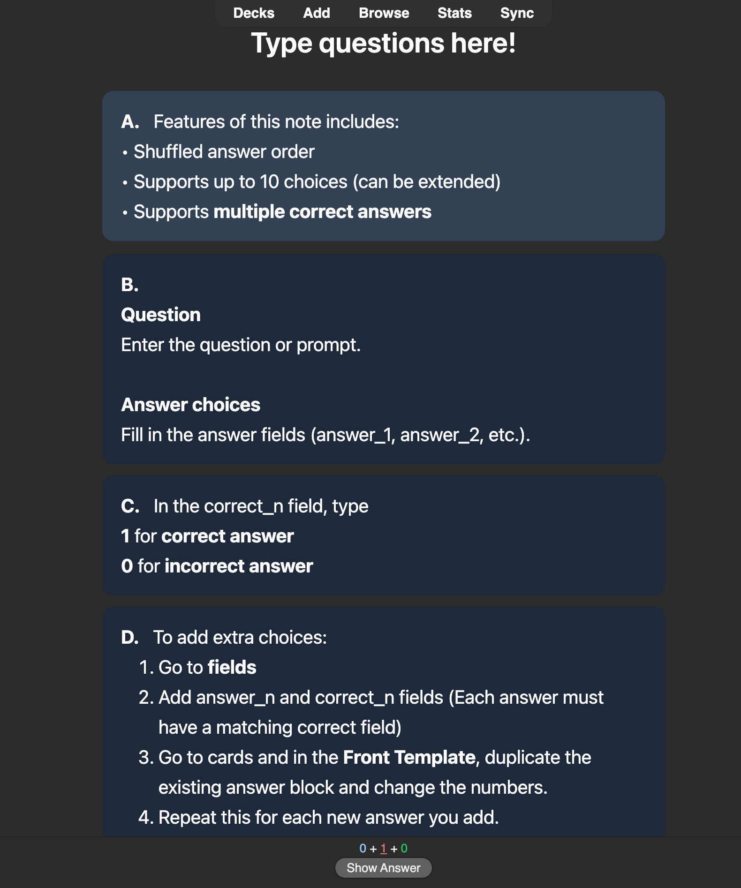
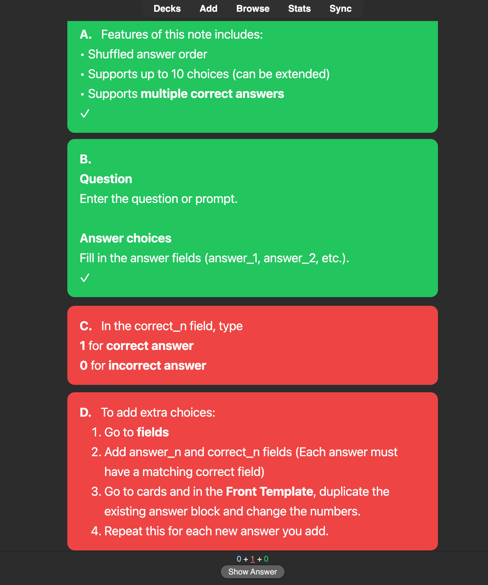

# Anki Shuffle MCQ

A custom **MCQ note template for Anki** that allows you to create flashcards with **shuffled answers**, **multiple correct answers**, and **customizable answer counts**.  

<p align="center">

</p>

Suitable for **exams, quizzes, and concept testing**.

## Features

- Randomized answer order
- Supports **up to 10 answer choices** (extendable)
- Supports **multiple correct answers**
- Optional **explanation section**

<br>

## Download

**Download** the `.apkg` file and import it into Anki.  


[Download Template](https://github.com/JoMamaho/Anki-Shuffle-MCQ/blob/main/Anki%20Shuffle%20MCQ%20Template.apkg)

<br>

## How to Use
#### 1. Enter the Question

Write your question in the **Question** field.

---

#### 2. Add Answer Choices

Fill in the answer fields:
```
answer_1
answer_2
answer_3
answer_4
…
```

You can add up to 10 answer choices (extendable).

---

#### 3. Mark Correct Answers
Each answer has a corresponding **correct field**:
```
correct_1
correct_2
correct_3
correct_4
…
```

In the `correct_n` field, type:
- `1` → correct answer  
- `0` → incorrect answer  

You can mark **multiple answers as correct**.

---

<br>

## Preview

<p align="center">

</p>


<br>

## License
This project is licensed under the MIT License.
MIT License © 2026 bluh bluh
